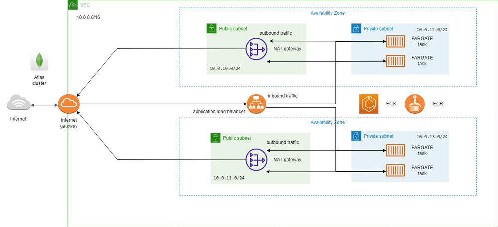

## ECS cluster

This is a terraform project in charge of creating the IaC for an ECS cluster in aws, the application hosted
in the cluster can be found in the following repository:

https://github.com/SalvadorM271/testmernapp/tree/feature/new_feature

## AWS services and resources use:

- VPC
- Subnets
- Security groups
- Internet Gateway
- NAT gateway
- ECS cluster
- Application Load Balancer
- Autoscaling
- Cloudwatch logs

## How it works 

This is a multi AZ deployment of a mern stack app, I have use two availability zones to deploy the application, each has one public subnet and one private the private subnet is used to deploy the fargate tasks giving us an isolated place to host the app which case makes the app unable to connect to the internet directly, in order to remedy that i have set up NAT gateways in the public subnet in order to route outbound request from our application to the internet gateway which is what i use to connect the VPC to the internet, I have two NATs gateways in order to keep the infrastructure up even if one of the AZ fails (in reality only one is needed but is best to have two for production environments), additionally i have set up a load balancer in order to route traffic to my frontend task, as for the task i have choosen to use fargate since it requires less maintenance on our parts since is a severless solution which normally results in a lesser cost offering better or equal performance, lastly i want to point out that this infrastructure has been develop having microservices in mind since having our different services decouple makes for a more resilient application that wont fail even if any of its components stops working, this together with the use of IaC makes for an easier experience when dealing with critical errors.

## Diagram

